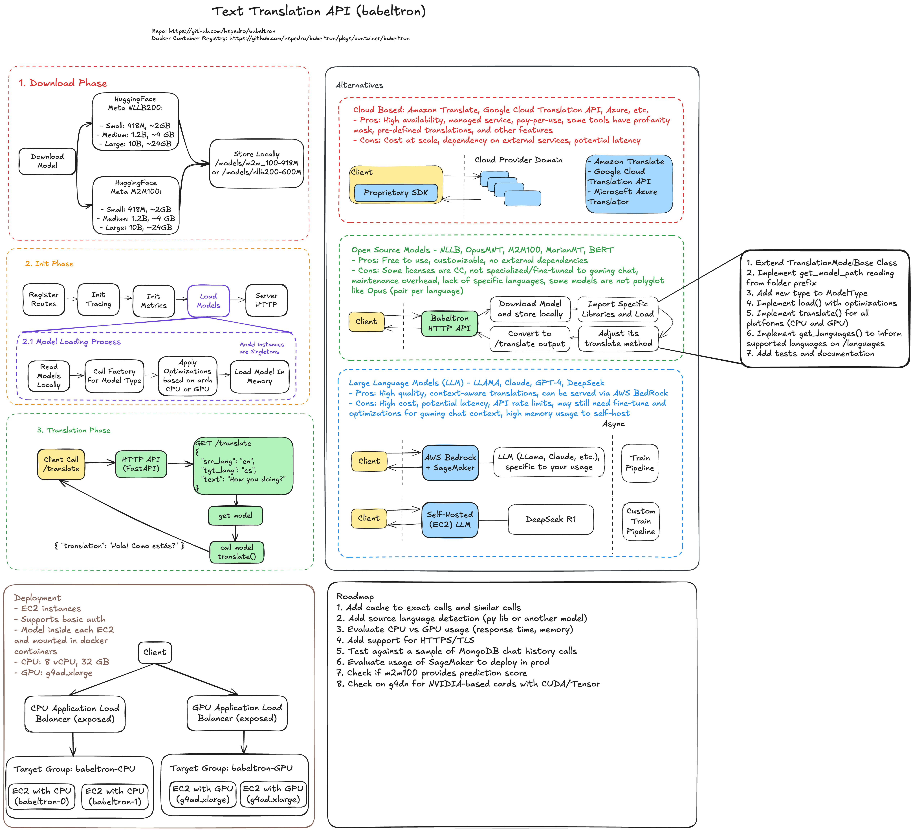

# Babel Tron

[](https://www.python.org/downloads/)
[](https://github.com/hspedro/babeltron/blob/main/LICENSE)
[](https://github.com/psf/black)
[](https://github.com/hspedro/babeltron/actions/workflows/test.yml)

A Python-based REST API that leverages powerful multilingual translation models (M2M100 and NLLB) to
provide efficient text translation services. Babeltron exposes a simple interface
for translating text between multiple languages, making powerful neural machine
translation accessible through straightforward API endpoints.

## Features

- Receives a text, source language and destination language, then returns the text
  translated
- Supports two powerful translation models:
  - **M2M100**: Supports 100+ languages
  - **NLLB (No Language Left Behind)**: Supports 200+ languages, including many low-resource languages
- **Language Detection**: Automatically detects the language of text using the Lingua language detector, which is highly accurate even for short text snippets
  - Lingua prioritizes quality over quantity, focusing on accurate detection rather than supporting every possible language
  - Supports 75 different languages with high precision, even though the translation models accept 200+ languages
  - Particularly effective for short texts and informal language, making it ideal for real-world applications

## Requirements

- Python 3.9 or higher
- Poetry

## Installation

### Installing Poetry

This project uses Poetry for dependency management. To install Poetry:

```bash
curl -sSL https://install.python-poetry.org | python3 -
```

### Installing Project Dependencies

```bash
make install
```

## Development Commands

The project includes several helpful make commands:

- `make install` - Install project dependencies
- `make test` - Run tests
- `make lint` - Run linters (flake8, isort, black)
- `make format` - Format code with isort and black
- `make coverage` - Run tests with coverage report
- `make coverage-html` - Generate HTML coverage report

## Testing and Code Coverage

### Running Tests with Coverage

To run tests with coverage reporting:

```bash
make coverage
```

For a detailed HTML coverage report:

```bash
make coverage-html
```

The HTML report will be generated in the `htmlcov` directory.

### Coverage Configuration

The project uses a `.coveragerc` file to configure coverage settings. This ensures consistent coverage reporting across different environments.

## Downloading Translation Models

Babeltron supports two types of translation models: M2M100 and NLLB (No Language Left Behind). You can download models of different sizes depending on your needs and hardware constraints:

### M2M100 Models

```bash
# Download the small M2M100 model (418M parameters, ~1GB disk space)
make download-model-m2m-small

# Or download medium M2M100 model (1.2B parameters, ~2.5GB disk space)
make download-model-m2m-medium

# Or download large M2M100 model (12B parameters, ~24GB disk space)
make download-model-m2m-large
```

### NLLB Models

```bash
# Download the small NLLB model (600M parameters, ~1.2GB)
make download-model-nllb-small

# Or download large NLLB model (3.3B parameters, ~6.6GB)
make download-model-nllb-large
```

For backward compatibility, `make download-model` will download the small M2M100 model.

### Model Size Considerations

#### M2M100 Models
- **Small (418M)**: ~1GB disk space, less memory required, faster but less accurate
- **Medium (1.2B)**: ~2.5GB disk space, moderate memory requirements
- **Large (12B)**: ~24GB disk space, requires significant RAM/GPU memory

#### NLLB Models
- **Small (600M)**: ~1.2GB disk space, less memory required, faster but less accurate
- **Large (3.3B)**: ~6.6GB disk space, requires significant RAM/GPU memory

Choose based on your hardware constraints and translation quality requirements. NLLB models generally provide better translation quality for low-resource languages compared to M2M100.

### Language Support

#### M2M100
Supports 100+ languages with ISO language codes like "en", "fr", "es", etc.

#### NLLB (No Language Left Behind)
Supports 200+ languages with FLORES-200 language codes that include both language and script information, such as:
- "eng_Latn" (English, Latin script)
- "fra_Latn" (French, Latin script)
- "zho_Hans" (Chinese, Simplified Han script)
- "ara_Arab" (Arabic, Arabic script)

NLLB includes many low-resource languages not available in other translation models, making it particularly valuable for global accessibility. The full list of supported languages can be found in the [FLORES-200 dataset documentation](https://github.com/facebookresearch/flores/blob/main/flores200/README.md).

When using NLLB, you must use the FLORES-200 language codes. For convenience, Babeltron also supports common ISO codes (like "en", "fr") and will automatically convert them to the corresponding FLORES-200 codes.

## Running the API Server

After installing dependencies and downloading a model, you can run the API server locally:

```bash
# Run the server in development mode with auto-reload
make serve

# Run with a custom port
make serve PORT=8080

# Or run in production mode (no auto-reload)
make serve-prod

# Run production mode with a custom port
make serve-prod PORT=8080
```

The API will be available at http://localhost:8000 by default, or at the port you specified.

### API Usage Examples

Once the server is running, you can use the translation API:

```bash
# Translate text from English to Spanish using M2M100 (default)
curl -X POST "http://localhost:8000/api/v1/translate" \
  -H "Content-Type: application/json" \
  -d '{
    "text": "Hello, how are you?",
    "src_lang": "en",
    "tgt_lang": "es"
  }'

# Response:
# {"translation":"Hola, ¿cómo estás?"}

# Translate text with automatic language detection
curl -X POST "http://localhost:8000/api/v1/translate" \
  -H "Content-Type: application/json" \
  -d '{
    "text": "Bonjour, comment ça va?",
    "src_lang": "auto",
    "tgt_lang": "en"
  }'

# Response:
# {
#   "translation": "Hello, how are you?",
#   "model_type": "m2m100",
#   "architecture": "cpu_compiled",
#   "detected_lang": "fr",
#   "detection_confidence": 0.98
# }

# You can also omit the source language entirely for automatic detection
curl -X POST "http://localhost:8000/api/v1/translate" \
  -H "Content-Type: application/json" \
  -d '{
    "text": "Hola, ¿cómo estás?",
    "tgt_lang": "en"
  }'

# Response includes the detected language and confidence score
# {
#   "translation": "Hello, how are you?",
#   "model_type": "m2m100",
#   "architecture": "cpu_compiled",
#   "detected_lang": "es",
#   "detection_confidence": 0.95
# }

# Translate text with NLLB model using FLORES-200 language codes
curl -X POST "http://localhost:8000/api/v1/translate" \
  -H "Content-Type: application/json" \
  -d '{
    "text": "Hello, how are you?",
    "src_lang": "eng_Latn",
    "tgt_lang": "spa_Latn",
    "model_type": "nllb"
  }'

# Response:
# {"translation":"Hola, ¿cómo estás?"}

# Translate to a low-resource language (Yoruba) using NLLB
curl -X POST "http://localhost:8000/api/v1/translate" \
  -H "Content-Type: application/json" \
  -d '{
    "text": "Hello, how are you?",
    "src_lang": "eng_Latn",
    "tgt_lang": "yor_Latn",
    "model_type": "nllb"
  }'
```

Note: NLLB models use different language codes than M2M100 models. For example, "en" in M2M100 corresponds to "eng_Latn" in NLLB. Babeltron will attempt to convert common ISO codes to FLORES-200 codes when using NLLB.

You can also access the interactive API documentation at http://localhost:8000/docs.

## API Documentation

Babeltron provides interactive API documentation:

- **Swagger UI**: Available at http://localhost:8000/docs when the server is running
- **ReDoc**: Available at http://localhost:8000/redoc for an alternative documentation view

These interactive documentation pages allow you to:
- Explore all available endpoints
- See request and response schemas
- Test the API directly from your browser
- View detailed descriptions of each endpoint and parameter

## Running with Docker

Babeltron can be run as a Docker container, which simplifies deployment and isolates dependencies.

### Building and Running with Docker

```bash
# Start services with Docker Compose using M2M100 model (default)
make docker-up

# Start services with Docker Compose using NLLB model
make docker-up MODEL_TYPE=nllb

# You can also specify the model size
make docker-up MODEL_TYPE=nllb MODEL_SIZE=large
```

The API will be available at http://localhost:8000.

### Building Docker Images with Embedded Models

You can build Docker images with models embedded:

```bash
# Build with small M2M100 model (default)
make docker-build-with-model

# Build with large NLLB model
make docker-build-with-model MODEL_TYPE=nllb MODEL_SIZE=large
```

The resulting image will be tagged as `babeltron:m2m-small` or `babeltron:nllb-large` accordingly.

### Running Docker Containers

```bash
# Run with M2M100 model (default)
make docker-run

# Run with NLLB model
make docker-run MODEL_TYPE=nllb

# Run with specific model size
make docker-run MODEL_TYPE=nllb MODEL_SIZE=large

# Run with a custom port
make docker-run PORT=8080
```

### Using Docker Compose

```bash
# Start services with default port (8000)
make docker-compose-up

# Start services with custom port
make docker-compose-up PORT=8080

# Stop services
make docker-compose-down
```

### Environment Variables

The following environment variables can be used to configure the application:

- `MODEL_PATH`: Path to the model directory (default: `./models`)
- `MODEL_SIZE`: Size of model to use (`small`, `medium`, or `large`, default: `small`)
- `PORT`: Port to run the API server on (default: `8000`)
- `WORKER_COUNT`: Number of worker processes to use (default: `1`)
- `BABELTRON_MODEL_TYPE`: Type of model to use in the API (`m2m100` or `nllb`, default: `m2m100`)

### Docker Volume Mounts

The Docker setup mounts the local `./models` directory to `/models` inside the container. This allows you to:

1. Reuse downloaded models between container restarts
2. Use different model types and sizes without rebuilding the image
3. Persist models even if the container is removed

If no models are found when starting the container, you'll be prompted to download the model specified by the `MODEL_TYPE` and `MODEL_SIZE` variables (defaults to small M2M100 model).

## Distributed Tracing

Babeltron supports distributed tracing with OpenTelemetry and Jaeger. The application is configured to send traces to the OpenTelemetry Collector, which forwards them to Jaeger.

### Configuration

Tracing can be configured using the following environment variables:

- `OTLP_MODE`: The OpenTelemetry protocol mode (`otlp-grpc` or `otlp-http`)
- `OTEL_SERVICE_NAME`: The name of the service in traces (default: `babeltron`)
- `OTLP_GRPC_ENDPOINT`: The endpoint for the OpenTelemetry Collector using gRPC (default: `otel-collector:4317`)
- `OTLP_HTTP_ENDPOINT`: The endpoint for the OpenTelemetry Collector using HTTP (default: `http://otel-collector:4318/v1/traces`)

### Accessing Jaeger UI

When running with Docker Compose, you can access the Jaeger UI at:

```
http://localhost:16686
```

### Tracing Features

The distributed tracing implementation provides insights into:

- Request flow through the API
- Detailed timing of translation steps:
  - Tokenization
  - Model inference
  - Decoding
- Error details and context
- Cross-service communication

### Disabling Tracing

To disable tracing, set the `OTLP_GRPC_ENDPOINT` environment variable to `disabled`:

```yaml
environment:
  - OTLP_GRPC_ENDPOINT=disabled
```

## Authentication

Babeltron supports HTTP Basic Authentication to secure API endpoints. When enabled, all API endpoints (except for health checks, metrics, and documentation) require authentication.


### Enabling Authentication

Basic authentication is enabled by setting both environment variables:

```bash
AUTH_USERNAME=your_username
AUTH_PASSWORD=your_password
```

If either variable is not set, authentication will be disabled.

### Using Authentication

When authentication is enabled, clients must include an HTTP Basic Authentication header with each request:

```
Authorization: Basic <base64-encoded-credentials>
```

Where `<base64-encoded-credentials>` is the Base64 encoding of `username:password`.

#### Example with curl

```bash
# Replace 'your_username' and 'your_password' with your credentials
curl -X POST "http://localhost:8000/api/v1/translate" \
  -H "Content-Type: application/json" \
  -H "Authorization: Basic $(echo -n 'your_username:your_password' | base64)" \
  -d '{"text": "Hello world", "src_lang": "en", "tgt_lang": "fr"}'
```

or

```bash
# Replace 'your_username' and 'your_password' with your credentials
curl -X POST "http://localhost:8000/api/v1/translate" \
  -H "Content-Type: application/json" \
  -u "your_username:your_password" \
  -d '{
    "text": "Hello world",
    "src_lang": "en",
    "tgt_lang": "fr"
  }'
```

### Excluded Paths

The following paths are excluded from authentication requirements:

- `/docs` - Swagger UI documentation
- `/redoc` - ReDoc documentation
- `/openapi.json` - OpenAPI schema
- `/healthz` - Health check endpoint
- `/readyz` - Readiness check endpoint
- `/metrics` - Prometheus metrics endpoint

## Contributing

Install pre-commit hooks with `make pre-commit-install` and refer to the [CONTRIBUTING.md](docs/CONTRIBUTING.md) file for more information.

## Architecture

For a detailed technical overview of the system architecture, including diagrams and component interactions, please refer to our [Architecture Documentation](docs/architecture.md).



## Downloading Models

Before using Babeltron, you need to download at least one model:

### Translation Models

```bash
# Download the default M2M100 small model (418M parameters)
make download-model-m2m-small

# Download the M2M100 medium model (1.2B parameters)
make download-model-m2m-medium

# Download the M2M100 large model (12B parameters)
make download-model-m2m-large

# Download the NLLB small model (600M parameters)
make download-model-nllb-small

# Download the NLLB large model (3.3B parameters)
make download-model-nllb-large
```

### Language Detection Model

```bash
# Download the XLM-RoBERTa model for language detection
make download-model-xlm-roberta
```

## API Usage

### Translation

```bash
curl -X POST "http://localhost:8000/translate" \
     -H "Content-Type: application/json" \
     -d '{"text": "Hello, how are you?", "source_lang": "en", "target_lang": "fr"}'
```

Response:
```json
{
  "translated_text": "Bonjour, comment ça va ?"
}
```

### Language Detection

```bash
curl -X POST "http://localhost:8000/detect" \
     -H "Content-Type: application/json" \
     -d '{"text": "Hello, how are you?"}'
```

Response:
```json
{
  "language": "en",
  "confidence": 0.98
}
```

## License

MIT License

Copyright (c) 2025 Pedro Soares
