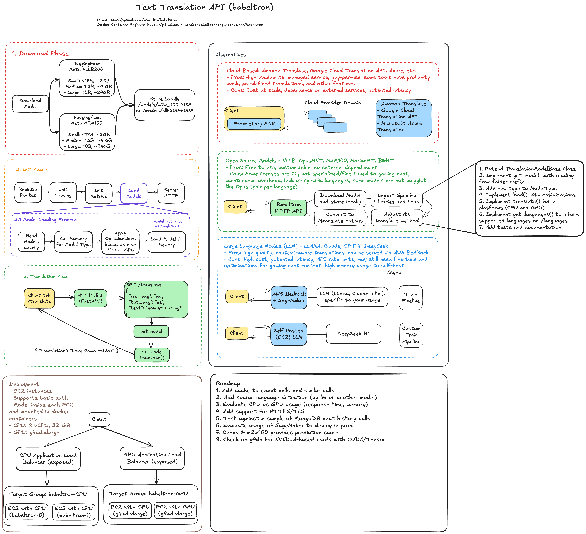

# Babeltron Architecture

## Overview
Babeltron is a high-performance translation service that leverages state-of-the-art machine learning models to provide accurate and efficient translations. The system is designed to be scalable, maintainable, and cost-effective while delivering high-quality translations across multiple languages.

## System Components and Flow

### 1. Model Download and Initialization
The system supports two primary translation models that are downloaded and initialized during startup:

#### M2M100 (418M)
- A multilingual model capable of translating between 100+ languages
- Optimized for general-purpose translation
- Provides a good balance between quality and performance
- Default model for most translation tasks

#### NLLB (600M)
- Facebook's No Language Left Behind model
- Specialized in low-resource language pairs
- Enhanced performance for specific language combinations
- Available as an alternative when higher quality is required

### 2. System Initialization
The service initializes its components and prepares for handling translation requests:

### 3. Translation Process
The core translation flow involves several steps:

1. **Request Reception**
   - Client sends translation request to API
   - Request is validated and processed

2. **Model Selection**
   - System determines appropriate model based on:
     - Request parameters
     - Language pair
     - Performance requirements

3. **Translation Processing**
   - Selected model processes the text
   - System records performance metrics
   - Translation is completed

4. **Response Generation**
   - Results are formatted
   - Metrics are included
   - Response is sent to client

### 4. API Layer
The service exposes a RESTful API with the following endpoints:

#### Health Check (`/healthz`)
- Monitors system health and availability
- Provides basic system metrics
- Used for load balancing and monitoring

#### Translation (`/translate`)
- Main translation endpoint
- Accepts POST requests with:
  - Source text
  - Source language code
  - Target language code
  - Optional model type specification
- Returns:
  - Translated text
  - Model information
  - Performance metrics

### 5. Monitoring and Metrics
The system includes comprehensive monitoring capabilities:

#### Prometheus Integration
- Collects system metrics
- Tracks translation performance
- Monitors resource utilization
- Enables alerting and dashboards

#### Key Metrics
- Translation latency
- Request throughput
- Error rates
- Model-specific performance
- Resource usage

### 6. Deployment Architecture
The system can be deployed in various configurations:

## Alternative Solutions

### Cloud-based Services
- **Amazon Translate**
  - Pros: Managed service, high availability
  - Cons: Cost at scale, external dependency

- **Google Cloud Translation API**
  - Pros: Wide language coverage, high accuracy
  - Cons: Vendor lock-in, pricing complexity

### Open Source Models
- **OpusMT**
  - Pros: Free, customizable
  - Cons: Resource intensive, maintenance overhead

- **MarianMT**
  - Pros: Lightweight, fast
  - Cons: Limited language pairs

### Large Language Models
- **GPT-4/Claude**
  - Pros: High quality, context-aware
  - Cons: High cost, API limitations

## Decision Factors

### When to Choose Babeltron
1. **Cost Control**
   - Self-hosted solution
   - Predictable pricing
   - No per-request costs

2. **Performance Requirements**
   - Low latency
   - High throughput
   - Consistent response times

3. **Data Privacy**
   - On-premises deployment
   - Data sovereignty
   - No external API calls

4. **Customization Needs**
   - Model fine-tuning
   - Custom language pairs
   - Specialized domains

### When to Consider Alternatives
1. **Limited Resources**
   - Cloud services for minimal infrastructure
   - Managed solutions for reduced maintenance

2. **Specialized Requirements**
   - Domain-specific models
   - Rare language pairs
   - Custom integrations

## Future Considerations

1. **Scalability**
   - Horizontal scaling
   - Load balancing
   - Caching strategies

2. **Model Evolution**
   - New model integration
   - Performance optimization
   - Quality improvements

3. **Feature Expansion**
   - Additional endpoints
   - Enhanced monitoring
   - Advanced customization options
